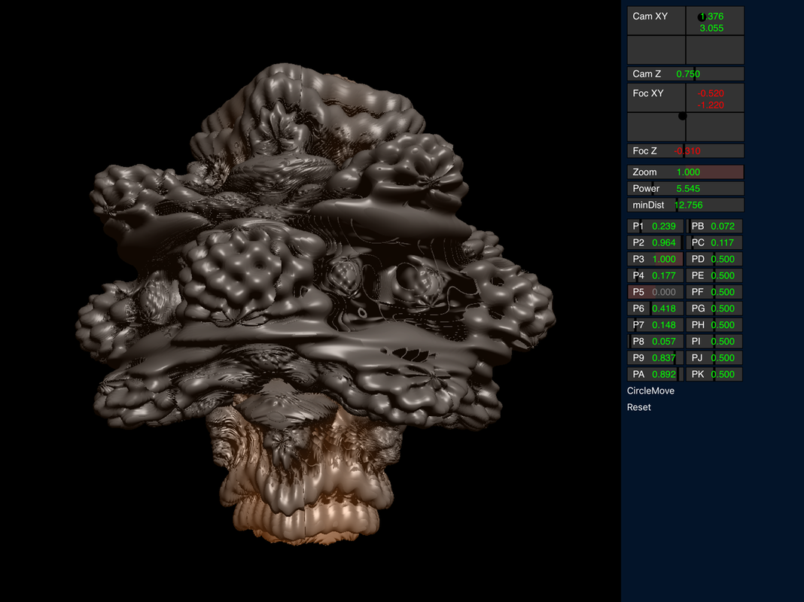

# RayMarchPlayground
Utility program for iPad for experiments in raymarching lighting effects. Uses Swift and Metal.

Learned some ray marching lighting effects by studying shockham's mandelbulb posting: \
https://github.com/shockham/mandelbulb

This little app uses his shader routines, and adds a bunch of widgets \
so we can alter the parameters in real-time.

Useful for me as I try to find effects to use in my other apps. \
Perhaps useful for you if you need a bunch of float values to control in your own shader experiments.

